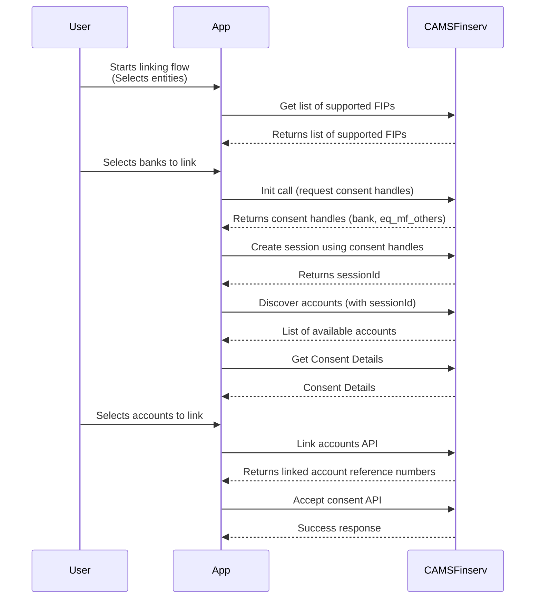

# 🏦 Account Aggregator (CAMSFinserv) Integration

## 📘 Overview

This document explains the flow, data models, and implementation details of the **Account Aggregator (AA)** feature in our app.  
The goal is to enable users to link their financial entities — such as **bank accounts, mutual funds, and other investment accounts** — via the **CAMSFinserv** Account Aggregator ecosystem.

Read more on AA Ecosystem [here.](https://sahamati.org.in/what-is-account-aggregator/)

## 🎯 Purpose

This module:

1. Initiates user consent journey with CAMSFinserv.
2. Creates a session for discovery and linking.
3. Fetches discoverable financial accounts.
4. Allows the user to link selected accounts.
5. Accepts the consent to finalize linking.

## 🧭 High-Level Flow

_**(Add 'Markdown Preview Mermaid Support' extension in VSCode)**_

